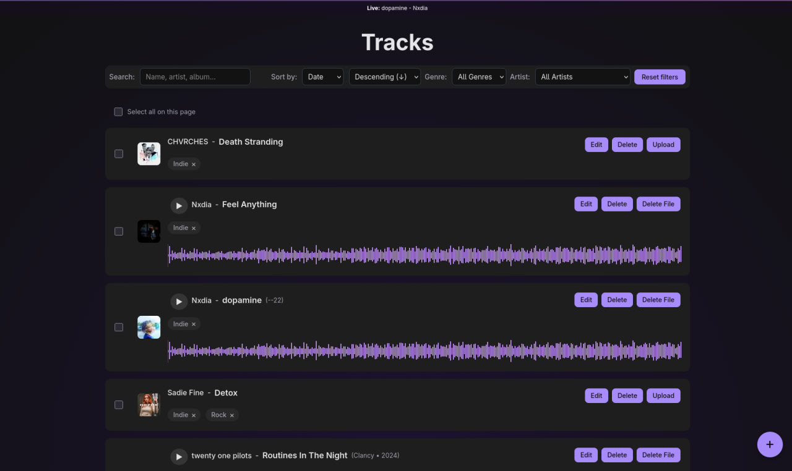

# 🎵 Music Track Management App

A single-page application built with React and Vite for managing a personal music track library. It interacts with a provided Node.js backend API to perform CRUD operations, upload audio files, and manage track metadata.



## 🚀 Tech Stack

*   **Frontend:** React 18, Vite, TypeScript
*   **API:** Apollo Client 
*   **Protocol:** GraphQL (Queries, Mutations, Subscriptions)
*   **Audio:** WaveSurfer.js (for playback and visualization)
*   **UI/UX:** Modals, `react-hot-toast` (notifications), Custom Hooks, CSS
*   **Development:** NodeJS (v20.13.1 required), npm
*   **Global state:** Zustand (for UI state: modal windows, selections)

## ⚙️ Getting Started

1. **Start API Server** 
The API should typically be available at `http://localhost:8000`.
2. **Install dependencies: (in /app)**
```bash
npm install
```
3. **Run the development server:**
```bash
npm start
```

4. **Open the application:**
    Navigate to `http://localhost:3000` in your browser.
    
## The .env example is located in .env.example

## 📜 Available scripts

* `npm run dev`: Starts the development server with Hot-Reload.
* `npm run build`: Builds the application for production in the `dist` folder.
* `npm run preview`: Starts a local server to preview the production build.
* `npm run lint`: Runs code inspection using ESLint.
* `npm test`: (Add, if any) Runs tests.
* `npx playwright test`: Run e2e test.
* `npm run test:ct`: Run components tests.

## 🎉 Features Implemented

*   **Bulk Delete:** Functionality to select and delete multiple tracks simultaneously.
*   **Optimistic UI Updates:** Implemented for Edit, Delete, Delete File, and Bulk Delete actions for a smoother user experience.
*   **Audio Waveform Visualization:** Integrated WaveSurfer.js to display waveforms for tracks with audio files.
