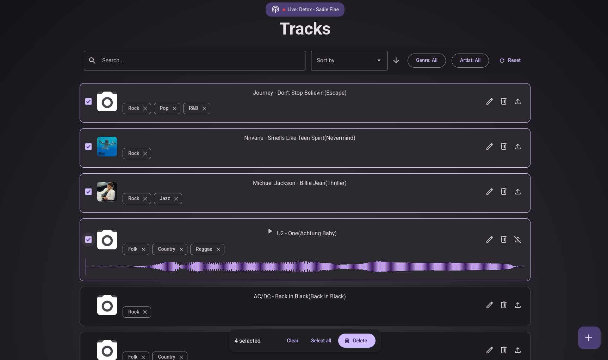

# 🎵 Music Track Management App

A single-page application built with React and Vite for managing a personal music track library. It interacts with a provided Node.js backend API to perform CRUD operations, upload audio files, and manage track metadata.

### Before and After
Comparison of the visual style of the old and new versions of the project.
| Old version                                   |  New version                                    |
| -------------------------------------------------- | -------------------------------------------------- |
|  |  |


## 🚀 Tech Stack

*   **Frontend:** React, Vite, TypeScript
*   **API:** Apollo Client 
*   **Protocol:** GraphQL (Queries, Mutations, Subscriptions)
*   **Audio:** WaveSurfer.js (for playback and visualization)
*   **UI/UX:** Modals, `react-hot-toast` (notifications), Custom Hooks, CSS
*   **Development environment:** Node.js, **pnpm** (package manager)
*   **Global state:** Zustand

## ⚙️ Getting Started

## The .env example is located in .env.example

1. **Start API Server** 
The API should typically be available at `http://localhost:8000`.
2. **Install dependencies: (in /app)**
```bash
    pnpm install
```
3. **Run the development server:**
```bash
    pnpm start
```

4. **Open the application:**
    Navigate to `http://localhost:3000` in your browser.
    

## 📜 Available scripts

| Command                       | Description                                                                |
| ----------------------------- | -------------------------------------------------------------------   
| `pnpm lint`                   | Launches a code check using ESLint.                        |
| `pnpm type-check`             | Performs TypeScript type checking without compilation.                  |
| `pnpm run storybook`          | Run Storybook                   |


### Testing

| Command                       | Description                                                                |
| ----------------------------- | ------------------------------------------------------------------- |
| `pnpm test`                   | Runs unit tests with Vitest.                            |
| `pnpm test:ct`                | Runs component tests with Playwright.                 |
| `pnpm exec playwright test`   | Runs end-to-end (E2E) tests with Playwright.           |


## 🎉 Features Implemented

*   **Bulk Delete:** Functionality to select and delete multiple tracks simultaneously.
*   **Optimistic UI Updates:** Implemented for Edit, Delete, Delete File, and Bulk Delete actions for a smoother user experience.
*   **Audio Waveform Visualization:** Integrated WaveSurfer.js to display waveforms for tracks with audio files.
*   **Design and styling:** Materials from Material Design 3 are used in the design